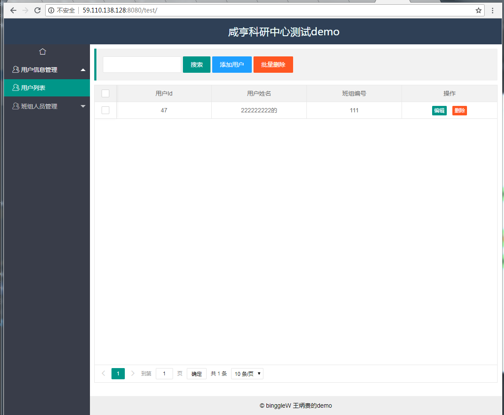

# 简介
   &nbsp;&nbsp;&nbsp;&nbsp;&nbsp;&nbsp; 该项目是作者入职公司时，项目经理交给我的一个测试任务，要求：用他给的一个demo（这里面什么都没有只有一个空的框架）然后自己设计表，设计页面，完成一个简单的例子，而且完成的程度要求没有bug而且能够用成产环境，才算合格。
## 1.项目运行环境
     jdk1.7+tomcat7.0+mysql5.7+idea(作者我用的是2017版的)
## 2.项目所用技术
     1.本项目前端用的layui2.X模块化框架搭建的
    2.后台用的是比较老点的技术hibernate+struts2.0+spring3.0
## 3.项目部署
     
      1.将项目从github上下载下来后[link](https://github.com/bingglewang/hangzhoutest.git)
    2.将该项目用idea打开，(一般是不需要怎么配置的，因为我都配置好了)，如果由于自己环境的问题，那么请下载相应的
      环境安装和配置下就可以。
    3.将项目里面的hangzhou.sql文件导入到自己本地的数据中，然后更改webcontent/web-inf/下的application.xml配置
      文件，将数据库用户名密码配置更改成自己本地的就ok
    3.点击idea里面的run按钮将项目运行起来，在浏览器里面输入[link](http://localhost:8080/test/index.jsp)
##     4.运行效果
在线观看效果：[在线查看效果](http://59.110.138.128:8080/test/)
